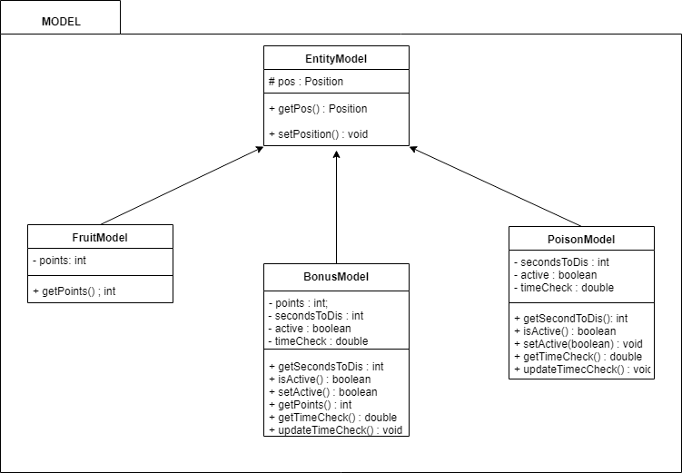
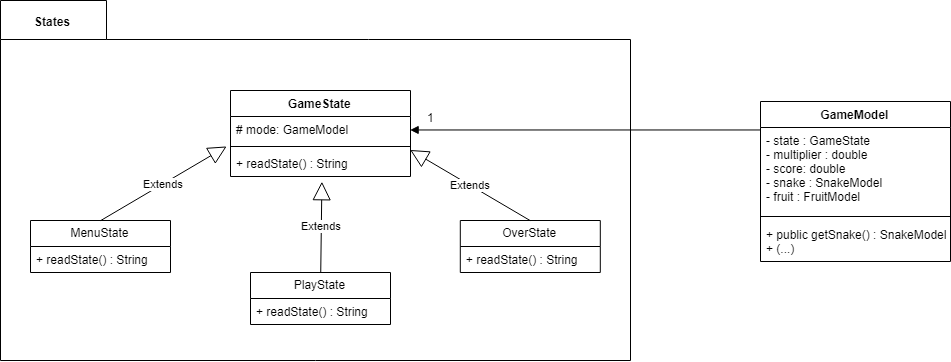
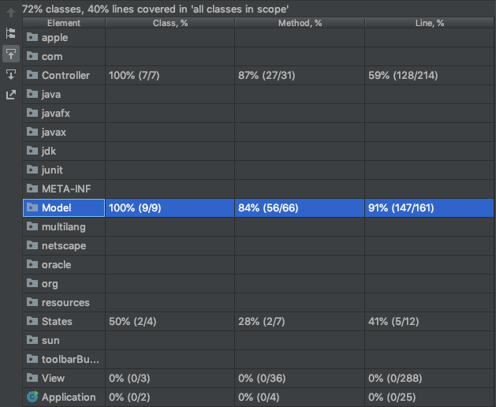
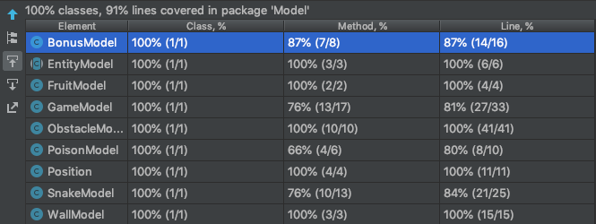

# LPOO_TG Project Name

> In our project we decided to attempt to create our own version of the game snake. In this game the goal is to score as many points as possible. The player controls the snake's movements and loses if the snake either hits a wall or itself and the way to earn points is to eat fruit.

>This project was developed by Eduardo Macedo (up201703658@fe.up.pt) and Margarida Cosme(up201709304@fe.up.pt)for LPOO 2018/2019.

## Implemented Features

>**Left** - The snake turns left when the left key is pressed.

>**Right** - The snake turns right when the right key is pressed.

>**Up** - The snake turns up when the up key is pressed.

>**Down** - The snake turns down when the down key is pressed.

>**Eating fruit** - When the snake eats fruit (by her head touching it), the fruit disappears and another fruit appears in another position and the player's score is increased by either 5 points, if the game is being played in the low speed mode, 10 points in the medium speed mode and 15 points in the hight speed mode. (in Lanterna P, in Swing and Apple)

>**Bonus** - Throughout the game, a bonus item will appear randomly on the arena. The player only has a limited to grab it but if he does, it will be awarded 5x the score he would get from the fruit (in Lanterna B, in Swing a rabbit)

>**Poison** - Throughout the game, a poison item will appear randomly on the arena for a couple of seconds several times. If the player runs into it it will lose the game. (in Lanterna P, in Swing a mushroom)

>**Obstacles** - When the payer reaches a certain score amount, obstacles will appear on the arena. The first at 100 points, the second set at 150. (Note: they are only drawn when it is possible meaning if the snake or entities are on the positions the obstacles would be drawn, the game waits for those positions to be clear and only then draws and sets them active)

>**Losing** - When the snake hits itself or hits a wall the game ends.

>**Quiting** - At any point if the player wants to quit they can do so by pressing the key "Q".

## Design

>***ARCHITECTURAL DESIGN***

>**Problem in Context** Have a good Architectural Pattern that is easy to understand and clean.

>**The Pattern** MVC

>**Implementation** With the Movie View Controller we achieve a modular design and separate the responsabilities to different modeules that are independent form themselves.
                    The ViewModel is in charge of drawing the objects, the GameModel stores information and GameController has the game´s "logic".

>**Consequences** With this we achieved advantages in the development process such as: faster development process. Each member can work on separate models since they are independent from each other;  th possibility of providing multiple views; A clean and (hopefully) easy to read code

//----------

>***Instantiation of the game's objects***

>**Problem in Context** When creating an object, no matter its type, we want to save its position as an attribute so that it can be checked and modified throughout the game.

>**The Pattern** Abstract Factory

>**Implementation** The object instantiation is made with EntityModel saving its position but it is the rest of each subclass's constructor that after that creates the necessary attributes of the object that make it unique (ex: BonusModel, FruitModel, PoionModel). They are designed to work together and in similar ways.

>**Consequences** This way it, promotes consistency around the models mentioned above, since all have a Position attribute and functions that revolve around it ad throughout the code are always accessed the same way

//----------

>***Menu Management***

>**Problem in Context** Have a clean, easy to use and working menu navigation

>**The Pattern** State Pattern 

>**Implementation** GameModel has GameState as an attribute (state). This indicates the state of the game (PlayState, OverState, MenuState). 

>**Consequences** Depending on what subclass of GameState state(attribute) is, this controls what models should be updated, which functions from controller should be called and what should be drawn on screen with simple code

//---------- 

## Known Code Smells and Refactoring Suggestions

> It is our understanding that we were able to correct most code smells, for an example GameController used to be a very large class, it has since been divided in controllers for each entities. We also used to have some functions that were never used and they have since been removed. 
However we still have some code smells that we were unable to solve. 

>One example can be seen in the View package, on some draw methods there are a lot of _switch statements_ thanks to the program finding the correct state of the game, we could't find a simpler way to do this
since how the program acts depends on the direction the snake is turned to. 

>Another code smell we were able to identify was the similarity between the classes BonusController and PoisonController, since both PoisonController's methods are also in BonusController's methods and are basically the same. However BonusController has a few extra since when the snake "eats" a bonus it grows and the player gains points, and when the snake "eats" poison it just dies.
>_(Alternative Classes with Different Interfaces)_

## Testing Results

>Some methods were related to either time stamps or random generators, therefore we were not able to test them all.

>-100% class coverage

>-84% method coverage

>-91% line coverage

>Test Coverage in the project:

>Test Coverage in the Model package:

## Self-evaluation

>Eduardo Macedo 60%

>Margarida Cosme 40%

